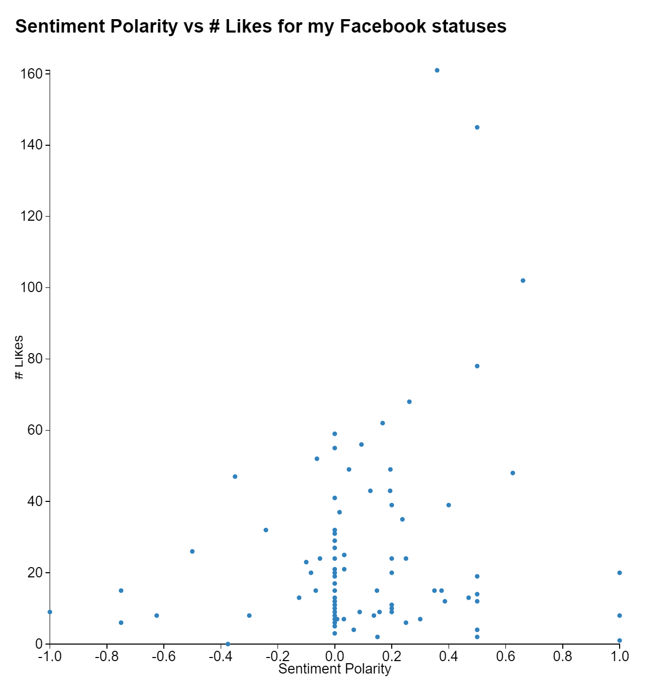
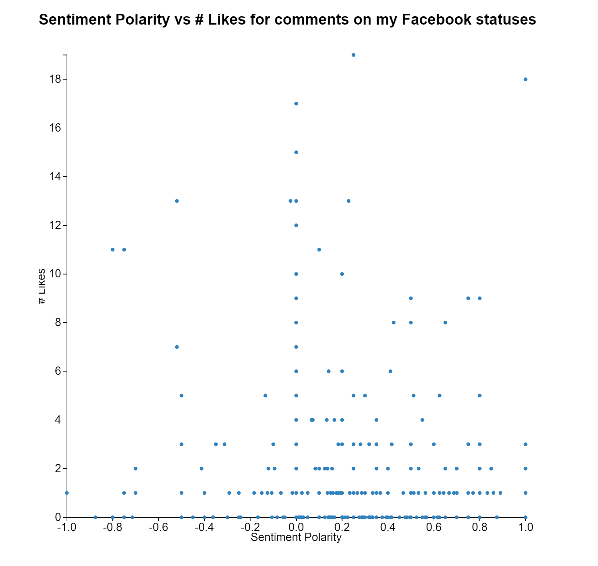

# fb-sentiment-vis

A data visualization that compares Facebook comments' and statuses' sentiments to the number of likes they received.

I wanted to see if there was a correlation or any noticeable trends, such as whether more positive sounding messages receive more likes, or whether more extreme sentiments receive more attention. I found that there were no noticeable trends between sentiment polarity and likes in my data, but feel free to try this yourself and see how it goes!

## Setup And Usage

1. After cloning or downloading this repo, create a folder called `data` in the root directory
2. Go to the [Facebook FQL Explorer Tool](https://developers.facebook.com/tools/explorer). You might have to be logged in and registered as a Facebook Developer to have access.
3. Click the `Get Token` dropdown, and then click the `Get User Access Token` option
4. On the modal, select the `user_posts` and `user_status` options
5. Click the `FQL Query` button under the Access Token input field
6. To retrieve your statuses data, run this query:

  ```
  SELECT message,like_info FROM status WHERE uid=me()
  ```
  To retrieve your comments data, run this query:

  ```
  SELECT text,likes FROM comment WHERE post_id IN (SELECT post_id FROM stream WHERE source_id=me())
  ```
7. Save the comments as `comments.json` and statuses as `statuses.json` inside the `data` folder. Note that if you have multiline comments or statuses, it is not valid JSON. I used my text editor to replace all newlines with spaces. It won't look "pretty", but it will be valid JSON. If you want to make it readable, you can pretty print it after making it valid.
8. Assuming you have `python`, `pip`, and `node.js`/`npm` installed, you can install dependencies, process the data, and open the visualization by running:

  ```
  sh setup.sh
  ```

## My Results

### Statuses


### Comments
These include both my own comments and my friends' comments on my statuses


## Discussion
As can be seen, there aren't any noticeable, significant trends in my data. Factors that have influenced my results might be a result of this visualization being rather lightweight that doesn't rigorously analyze the data. It's using the default `TextBlob` sentiment analysis and hasn't been trained. In addition, my friends and I have a set of slang and inside terminology that is probably not analyzed accurately. Also, there tends to be quite a bit of sarcasm in my data, which is quite difficult for sentiment analysis to determine consistently and accurately. Regardless, it can still be fun to play around with, and I hope to have time to explore more of my Facebook data in the future!